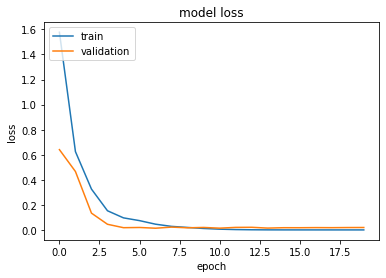
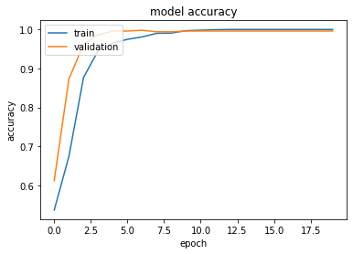
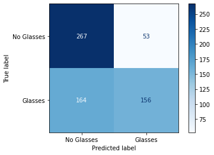

<style>
body {
text-align: justify}
</style>

```{r setup, include=FALSE}
knitr::opts_chunk$set(echo = FALSE)
```

```{r Lectura de librerías, include = FALSE, message = FALSE, warning = FALSE}
# Lectura de librerías importantes
library(imager)
library(tidyverse)
library(DT)
library(caret)
library(OpenImageR)
library(matrixcalc)
library(pander)
```


# Introducción

Las herramientas computaciones han venido avanzando a pasos agigantados en la última década, lo cual ha permitido que los diferentes dispositivos electrónicos a los que tenemos acceso permitan tener a disposición una mayor cantidad de recursos ocupando a la vez una menor cantidad de espacio y a un costo significativamente menor en comparación con los primeros dispositivos que salieron al mercado, dando la posibilidad a las masas y a pequeñas empresas de acceder a varios de estos instrumentos tecnológicos, y así, permitiendo la elaboración de proyectos más complejos con ayuda de estos implementos.

Con esto, aprovechando las herramientas tecnológicas que se tienen a la mano, se va a abordar el problema de analizar un conjunto de imágenes para determinar si las personas que están retratadas en estas están empleando gafas, y para conseguir esto se van a apelar a una técnica de aprendizaje estadístico muy usada hoy en día para el trabajo con imágenes y videos: las **redes neuronales convolucionales**, las cuales, en particular,  son muy útiles para llevar a cabo tareas de **clasificación de imágenes**.

# Documentación

Para poder llevar a cabo la clasificación de imágenes de personas según si están luciendo gafas o no, es necesario contar con varios centenares de fotos de personas que permitan alimentar el algoritmo. Además, se debe tener en cuenta que van a existir dos conjuntos de imágenes diferentes: uno de **entrenamiento**, que contiene dos mil ciento dieciocho imágenes y con el cual se podrá generar el algoritmo que realice la clasificación; un conjunto de **validación** con 495 imágenes; y otro de **prueba**, compuesto por seiscientas cuarenta  imágenes, y con el cual se puede verificar si el algoritmo entrenado con el conjunto anterior hace la tarea para la cual fue creado adecuadamente.

Así, es necesario crear estas dos bases de datos, y para conseguirlo, se emplearon las siguientes tres fuentes de imágenes:

* **1.** ***Kaggle.*** [*Kaggle*](https://www.kaggle.com) es una plataforma reconocida en el ámbito de la ciencia de datos, y en este se llevan a cabo competiciones y se alojan bases de datos con los cuales se puedan crear algoritmos de aprendizaje automático para poner en práctica los conocimientos de sus participantes. Entre estas bases de datos existe denominada ["*Glasses or No Glasses*"](https://www.kaggle.com/jeffheaton/glasses-or-no-glasses), en la que se incluyen cinco mil imágenes de personas con y sin gafas ordenadas de forma aleatoria, por lo que se tomaron las primeras mil quinientas imágenes para conformar un primer segmento del conjunto de **entrenamiento.** 
* **2.** Al inspeccionar la base de datos de *Kaggle* se observa que esta no tenía de suficientes fotografías de personas usando gafas de sol y diferentes a perspectivas frontales del rostro, pues todas eran fotos de perfil en primer plano, por lo que se seleccionan diversas imágenes en [*Google Images*](https://images.google.com/?gws_rd=ssl) para palear esta carencia. La totalidad de las fotografías obtenidas de *Google Images* han sido usadas en el conjunto de **entrenamiento.** Este conjunto se encuentra distribuido en las carpetas ***train***, ***Adiciones_gafas*** y ***Adiciones_No_Gafas*** de drive.
* **4.** Del mismo dataset de kaggle mencionado anteriormente se extrajeron otras 495 imágenes para conformar el conjunto de **validación**. Se encuentran ubicadas en la carpeta ***Prediccion*** de drive.
* **3.** La Universidad de California en Irvine, conocida por sus siglas *UCI* posee un sitio web en el cual aloja diferentes bases de datos para poder usar en trabajos que impliquen [aprendizaje automático](https://archive.ics.uci.edu/ml/index.php), y entre ellas contienen una con quinientas imágenes de [personas](https://archive.ics.uci.edu/ml/datasets/CMU+Face+Images), con algunas de ellas portando gafas de sol y otras no, por lo que resultan útiles para este trabajo y que serán usadas en el conjunto de **prueba.** Están ubicadas en la carpeta ***Faces*** de drive.


# Herramientas y materiales

## Materiales principales

Para la realización de este informe técnico, así como el planteamiento de la mayoría de los modelos predictivos que se presentarán más adelante se empleó la versión 4.0.5 de $\color{#00008b}{\textsf{R}}$, el cual es un software de programación especializado en estadística y ciencia de datos. Además, para la escritura del código de este lenguaje se empleó la versión 2021.09.1 del entorno de desarrollo integrado $\color{#1ac5ff}{\textsf{R}}$$\color{#696969}{\textsf{Studio}}$. Por otro lado, para el procesamiento de las imágenes, de manera que tuvieran un formato adecuado para poder entrenar al algoritmo de clasificación y también la creación del mismo modelo, se usó a $\color{cyan}{\textsf{Python}}$, que es un lenguaje de programación muy popular y con uso en diversas áreas como la ciencia de datos. Para ello, se usaron dos entornos: el primero es $\color{#1ac5ff}{\textsf{R}}$$\color{#696969}{\textsf{Studio}}$ (para el procesamiento de las imágenes) y el segundo es $\color{orange}{\textsf{Colaboratory}}$. Asimismo, se debe destacar que se usó al repositorio en línea $\textsf{GitHub}$ para poder guardar y compartir el código entre los autores de este trabajo, así como $\textsf{Google Drive}$ para el almacenamiento de las diferentes imágenes.


## Materiales secundarios

Vale la pena mencionar los paquetes de $\color{#00008b}{\textsf{R}}$ que más se emplearon en el marco de este trabajo para conseguir el desarrollo del modelo predictivo del número de vehículos registrados en el RUNT en el 2018:

* $\color{purple}{\texttt{caret}}$. **Versión 6.0-90** de octubre de 2021. Este [paquete](https://cran.r-project.org/web/packages/caret/caret.pdf) de $\color{#00008b}{\textsf{R}}$ resalta como el más importante de todos, puesto que con él fue posible desarrollar algunos de los modelos que se presentarán más adelante. Este paquete es útil para la creación de modelos de clasificación y regresión, así como para la generación de gráficos que permitan estudiar los resultados que se obtienen con sus funciones. Este un paquete desarrollado por el ***R Core Team*** (el equipo base que ayuda a desarrollar y mantener al lenguaje R), **Max Kuhn, Jed Wing, Steve Weston, Andre Williams, Chris Keefer, Allan Engelhardt, Tony Cooper** y **Breton Kenkel**, entre otros.

* $\color{purple}{\texttt{DT}}$. **Versión 0.20** Este [paquete](https://cran.r-project.org/web/packages/DT/index.html) de $\color{#00008b}{\textsf{R}}$ permite formatear tablas creadas con código de $\color{#00008b}{\textsf{R}}$ para luego ser presentadas con un estilo sobrio, elegante y sencillo, de forma que los lectores puedan entender amigablemente las tablas presentadas.

* $\color{purple}{\texttt{tidyverse}}$. **Versión 1.3.1.** Este es un [paquete](https://www.tidyverse.org/packages/) de $\color{#00008b}{\textsf{R}}$ desarrollado por **Hadley Wickham** que incluye otros paquetes como $\texttt{dplyr}$ y $\texttt{ggplot2}$, que fueron usados con frecuencia en este trabajo y que facilitan el manejo, análisis, transformación de bases de datos, así como la creación de gráficos elegantes y llamativos.

* $\color{purple}{\texttt{cv2}}$. **Versión 4.5.5.62.**. También conocido como $\texttt{OpenCV}$, es un [modulo](https://pypi.org/project/opencv-python/) de $\color{cyan}{\textsf{Python}}$ enfocado a trabajas relacionados como **visión artificial** y que fue empleado en este trabajo para poder realizar el procesamiento inicial de las fotografías de la base de datos.

* $\color{purple}{\texttt{glob}}$. Es un [modulo](https://docs.python.org/3/library/glob.html) de $\color{cyan}{\textsf{Python}}$ que resulta útil para el trabajo con direcciones de archivos y carpetas en un computador y que en este caso fue importante durante la etapa de preprocesamiento de imágenes para poderlas listas a varias de ellas y no tener que hacer el trabajo de forma manual con cada imágen.

* $\color{purple}{\texttt{os}}$. Es un [modulo](https://docs.python.org/3/library/os.html) de $\color{cyan}{\textsf{Python}}$ que resulta útil para el trabajo con direcciones de archivos y carpetas en un computador y que en este caso fue importante durante la etapa de preprocesamiento de imágenes para poderlas ubicar en las carpetas en las que estabas ubicadas y situarlas en un nuevo fólder después de ser procesadas.

* $\color{purple}{\texttt{Numpy}}$. Es un [módulo](https://numpy.org/) de $\color{cyan}{\textsf{Python}}$ de procesamiento de matrices de propósito general. Proporciona un objeto de matriz multidimensional de alto rendimiento y herramientas para trabajar con estas matrices. Es el paquete fundamental para la computación científica con $\color{cyan}{\textsf{Python}}$.

* $\color{purple}{\texttt{TensorFlow}}$. Es una [plataforma](https://www.tensorflow.org/?hl=es-419) de $\color{cyan}{\textsf{Python}}$ de código abierto de extremo a extremo para el aprendizaje automático. Cuenta con un ecosistema integral y flexible de herramientas, bibliotecas y recursos de la comunidad que permite que los investigadores innoven con el aprendizaje automático y los desarrolladores creen e implementen aplicaciones con tecnología de aprendizaje automático fácilmente.

* $\color{purple}{\texttt{PyTorch}}$. Es un [paquete](https://pypi.org/project/torch/) de $\color{cyan}{\textsf{Python}}$ que proporciona dos características de alto nivel: Cálculo de tensor (como NumPy) con fuerte aceleración de GPU, y Redes neuronales profundas construidas en un sistema de autograduación basado en cinta.

* $\color{purple}{\texttt{Matplotlib}}$ es una [biblioteca](https://matplotlib.org/) completa para crear visualizaciones estáticas, animadas e interactivas en $\color{cyan}{\textsf{Python}}$.

* $\color{purple}{\texttt{Keras}}$ es una [biblioteca](https://keras.io/) de Redes Neuronales de Código Abierto escrita en $\color{cyan}{\textsf{Python}}$. Es capaz de ejecutarse sobre TensorFlow, Microsoft Cognitive Toolkit o Theano. Está especialmente diseñada para posibilitar la experimentación en más o menos poco tiempo con redes de Aprendizaje Profundo.


# Desarrollo

Debido a que las imágenes con las que se a abordar este trabajo poseen características muy diferentes entre sí, se las va a llevar a cada una de ellas a una escala particular, que en este corresponde a $171 \times 213$, esto es, 171 pixeles de ancho 213 pixeles de alto, y luego se las deja en una escala de grises. A continuación se muestra el ejemplo con una imagen particular.

En la figura uno se puede ver una de las imágenes empleadas, la cual tiene las dimensiones y el color con el que fue obtenido de Internet vía $\textsf{Google Images}$

```{r, fig.align='center'}
ejem = load.image(paste0("Entre_SinProcesar.jpg"))
plot(ejem,
     main = "Ejemplo de una fotografía empleada",
     xlab = "Coordenada en x",
     ylab = "Coordenada en y",
     sub = "Ejemplo de una fotografía empleada. Esta retrata al personaje Dwight Schrute de la serie 'The Office'")
```

Nótese que el eje vertical apunta hacia cantidad positivas hacia abajo, mientras que el eje horizontal apunta hacia cantidad positivas hacia la derecha. A continuación, con el programa escrito en $\color{cyan}{\textsf{Python}}$ se realiza su procesamiento para escalarlo y dejarlo en escala de grises, obteniendo el resultado que se observa en la figura dos:

```{r, fig.align='center'}
ejem = load.image(paste0("Entre_Procesado.jpg"))
plot(ejem,
     main = "Ejemplo de una fotografía empleada",
     xlab = "Coordenada en x",
     ylab = "Coordenada en y",
     sub = "Ejemplo de una fotografía procesada, con escala de grisis y reescalamiento. Esta retrata al personaje Dwight Schrute de la serie 'The Office'")
```

Para el conjunto de validación aplicamos el mismo reescalamiento de la dimensión de las imágenes que a corresponde a $171 \times 213$. Para este formato de imágenes cargamos una librería pixmap puesto que su formato (.pgm) es diferente a el de las imágenes de entrenamiento, se creó una carpeta en Drive donde se ubicaron todas las imágenes re-escaladas en el archivo descargado se encontraban 3 versiones de cada imagen, se eligió solo la imagen con mayor tamaño y mejor definición de píxeles. A está carpeta se le asigna el nombre de **Procesadas_Faces** y se toman dos imágenes como ejemplo una con gafas y otra sin gafas. 

```{r, warning=FALSE, message=F}
library(pixmap)
x1= read.pnm(file = "image159.pgm")
x2= read.pnm(file = "image60.pgm")
```
En este gráfico notamos el respectivo reescalamiento y el color de la imagen, como ya estaba en escala de grises no tuvimos que cambiar el formato de color del conjunto de validación.

```{r, fig.align='center'}
plot(x1,main = "Ejemplo 1", axes=T)
plot(x2,main = "Ejemplo 2", axes=T)
```

## Estadísticos descriptivos

### Carga de las imágenes Procesadas fotos

Se utilizarán algunas funciones de la librería `imager` para la carga y la transformación de las imágenes.

A continuación se carga la librería `imager` y se indica el directorio donde se encuentran las imágenes:

```{r message=FALSE}
library(imager)
filenames <- list.files(path = "./Procesadas_Fotos", pattern="*.jpg")
```

El objeto `filenames` es una lista que contiene las imágenes. Para cargar una imagen con la funcón `load.image()` se debe indicar la ruta completa. Para completar el nombre de la ruta se usa la función `paste0()`:

```{r message=FALSE}
im <- load.image(paste0("./Procesadas_Fotos/",filenames[1]))
plot(im,main="Ejemplo de imagen")
```

La dimensión de la imagen es:

```{r}
pander(dim(im))
```

Esto quiere decir que el objeto `im` es una sola imagen de $171 \times 213$ pixeles.

#### Leer y transformar todas las imágenes

La librería `imager` contiene una serie de funciones para leer las imágenes de un directorio y convertirlas luego en un dataframe. Para ilustrar este proceso con un poco más de detalles se usará una función, `leer_y_trs_img()`, construida para mostrar cada paso de la transformación:

```{r}
leer_y_trs_img<-function(img_name,path=NULL,x_l=10,y_l=10){
  require(imager)
  img_nombre<-paste0(path,img_name) # completa el nombre de la imagen con la ruta
  imagen<-load.image(img_nombre) # carga la imagen
  img_gris<-grayscale(imagen) # convierte la imagen a escala de grises
  img_escalada<-resize(img_gris,x_l,y_l) # reescala la imagen
  return(img_escalada)
}
```

A continuación se muestra la función para cargar una sola imagen:

```{r, warning=FALSE}
x<-leer_y_trs_img(filenames[1],path="./Procesadas_Fotos/",x_l = 57,y_l = 71)
plot(x,main="Imagen de la carpeta Procesadas_Fotos")
```

Ahora se procede a cargar todas las imágenes que se indican en `filenames` usando `lapply()`:

```{r, warning=FALSE, message=FALSE}
lista_imagenes = lapply(filenames, leer_y_trs_img,path="./Procesadas_Fotos/",x_l = 57,y_l = 71) 
```

El objeto `lista_imagenes` es una lista de imágenes. Cada componente es una imagen y se puede utilizar así:

```{r}
par(mfrow=c(1,2))
plot(lista_imagenes[[2]],main="Ejemplo 1")
plot(lista_imagenes[[8]],main="Ejemplo 2")
```

Ahora se vectorizan las imágenes. Es decir, que vista la imagen como una matriz, sus columnas se ponen una debajo de la otra hasta obtener un vector. Estos vectores luego serán las filas de una matriz de datos donde cada pixel representa una variable y cada imagen representa una observación. El resultado de hacer esto para todas las imágenes es una matriz que tiene tantas filas como imágenes y tantas columnas como pixeles tengan las imágenes. La función `as.numeric()` aplicada sobre cada imagen devuelve un vector. Se aplica entonces la función  `as.numeric()` sobre cada entrada del objeto `lista_imagenes` con la función `lapply()`.

```{r warning=FALSE, message=FALSE}
imagenes_vectorizadas<-lapply(lista_imagenes, as.numeric)
```

El resultado, `imagenes_vectorizadas`, es una lista de vectores que se concatenan llamando `rbind()` con `do.call()`. El resultado tiene esta dimensión:

```{r}
matriz_imagenes = do.call('rbind', imagenes_vectorizadas)
pander(dim(matriz_imagenes)) # dimensión de la matriz resultante
# as.data.frame.imlist es una alternativa
```

#### Estadísticos descriptivos - Procesadas fotos

Al tener una matriz de datos se pueden hacer todo lo que se hace con una matriz de datos. Sin embargo, el gran número de variables hace que utilizar la función `summary()` o la función `pairs()` sea poco práctico. Una aproximación puede ser generar estadísticas de resumen para cada pixel y luego ver estas estadísticas en forma de imágenes. 

Veamos por ejemplo la imagen media:

```{r warning=FALSE, message=FALSE}
imagen_media_vec<-apply(matriz_imagenes,2,mean) # calcula el valor promedio para cada pixel 
```


```{r}
imagen_media<-as.cimg(array(imagen_media_vec,dim=c(57,71)))
plot(imagen_media,main="Imagen media de la carpeta Procesadas Fotos")
```

De igual manera se puede calcular la imagen que representa las desviaciones estándar para cada pixel:

```{r}
imagen_sd_vec<-apply(matriz_imagenes,2,sd)
imagen_sd<-as.cimg(array(imagen_sd_vec,dim=c(57,71)))
plot(imagen_sd,main="Imagen SD de la carpeta Procesadas Fotos")
```

#### Descartando información poco relevante

La imagen de desviaciones estándares nos muestra varias zonas negras, donde el valor es cero. Estas zonas de baja variabilidad corresponden a pixeles poco informativos en esta muestra de imágenes. El fondo de la imagen, común para todos los individuos es, por ejemplo, una zona de baja variabilidad. Usemos el histograma de la imagen de desviaciones estándares para detectar estas zonas de baja variabilidad:

```{r}
MASS::truehist(imagen_sd,main="Histograma de variabilidad de Imagen SD",xlab="Variabilidad",ylab="Frecuencia")
```

Consideraremos que pixeles con una variabilidad inferior a 0.26 no serán relevantes en los siguientes análisis. La función `threshold()` asigna un 0 a cada pixel cuya intensidad está por debajo de cierto valor y 1 al resto de pixeles y nos devuelve una imagen. A continuación se usa esta función especificando un valor de umbral de 0.26:

```{r}
imagen_sd_tr<-threshold(imagen_sd,thr = 0.26)
plot(imagen_sd_tr,main="Máscara")
```

La imagen `imagen_sd_tr` es una máscara. Las zonas en blanco representan los pixeles que se incluirán en los análisis y las zonas en negro los pixeles que se descartarán por su baja variabilidad.

Veamos cuantos pixeles se descartan:

```{r}
pander(table(imagen_sd_tr),style='simple')
```

Calculemos el porcentaje de información descartada:

```{r}
pander(table(imagen_sd_tr)[1]/sum(table(imagen_sd_tr))*100,style='simple')
```

Esto quiere decir que aproximadamente el 10% de los datos están en zonas de baja variabilidad.

### Carga de las imágenes Kaggle no gafas

Se repite el mismo procedimiento para la carpeta "Kaggle_NoGafas".
```{r message=FALSE}
library(imager)
filenames <- list.files(path = "./Kaggle_NoGafas", pattern="*.png")
```

```{r message=FALSE}
im <- load.image(paste0("./Kaggle_NoGafas/",filenames[1]))
plot(im,main="Imagen de la carpeta Kaggle_NoGafas")
```

La dimensión de la imagen es:

```{r}
pander(dim(im))
```

Esto quiere decir que el objeto `im` es una sola imagen de $171 \times 213$ pixeles.

#### Leer y transformar todas las imágenes

A continuación se muestra usa la función para cargar una sola imagen:
```{r, warning=FALSE}
x<-leer_y_trs_img(filenames[1],path="./Kaggle_NoGafas/",x_l = 57,y_l = 71)
plot(x,main="Imagen de la carpeta Kaggle_NoGafas")
```

Ahora se procede a cargar todas las imágenes que se indican en `filenames` usando `lapply()`:

```{r, warning=FALSE, message=FALSE}
lista_imagenes = lapply(filenames, leer_y_trs_img,path="./Kaggle_NoGafas/",x_l = 57,y_l = 71) 
```

El objeto `lista_imagenes` es una lista de imágenes. Cada componente es una imagen y se puede utilizar así:

```{r}
par(mfrow=c(1,2))
plot(lista_imagenes[[2]],main="Ejemplo 1")
plot(lista_imagenes[[8]],main="Ejemplo 2")
```

Ahora se vectorizan las imágenes. Es decir, que vista la imagen como una matriz, sus columnas se ponen una debajo de la otra hasta obtener un vector. Estos vectores luego serán las filas de una matriz de datos donde cada pixel representa una variable y cada imagen representa una observación. El resultado de hacer esto para todas las imágenes es una matriz que tiene tantas filas como imágenes y tantas columnas como pixeles tengan las imágenes. La función `as.numeric()` aplicada sobre cada imagen devuelve un vector. Se aplica entonces la función  `as.numeric()` sobre cada entrada del objeto `lista_imagenes` con la función `lapply()`.

```{r warning=FALSE, message=FALSE}
imagenes_vectorizadas<-lapply(lista_imagenes, as.numeric)
```

El resultado, `imagenes_vectorizadas`, es una lista de vectores que se concatenan llamando `rbind()` con `do.call()`. El resultado tiene esta dimensión:

```{r}
matriz_imagenes = do.call('rbind', imagenes_vectorizadas)
pander(dim(matriz_imagenes)) # dimensión de la matriz resultante
# as.data.frame.imlist es una alternativa
```

#### Estadísticos descriptivos - Kaggle Gafas

Al tener una matriz de datos se pueden hacer todo lo que se hace con una matriz de datos. Sin embargo, el gran número de variables hace que utilizar la función `summary()` o la función `pairs()` sea poco práctico. Una aproximación puede ser generar estadísticas de resumen para cada pixel y luego ver estas estadísticas en forma de imágenes. 

Veamos por ejemplo la imagen media:

```{r warning=FALSE, message=FALSE}
imagen_media_vec<-apply(matriz_imagenes,2,mean) # calcula el valor promedio para cada pixel 
```


```{r}
imagen_media<-as.cimg(array(imagen_media_vec,dim=c(57,71)))
plot(imagen_media,main="Imagen media de la carpeta Kaggle NoGafas")
```

De igual manera se puede calcular la imagen que representa las desviaciones estándar para cada pixel:

```{r}
imagen_sd_vec<-apply(matriz_imagenes,2,sd)
imagen_sd<-as.cimg(array(imagen_sd_vec,dim=c(57,71)))
plot(imagen_sd,main="Imagen SD de la carpeta Kaggle NoGafas")
```

#### Descartando información poco relevante

La imagen de desviaciones estándares nos muestra varias zonas negras, donde el valor es cero. Estas zonas de baja variabilidad corresponden a pixeles poco informativos en esta muestra de imágenes. El fondo de la imagen, común para todos los individuos es, por ejemplo, una zona de baja variabilidad. Usemos el histograma de la imagen de desviaciones estándares para detectar estas zonas de baja variabilidad:

```{r}
MASS::truehist(imagen_sd,main="Histograma de variabilidad de Imagen SD",xlab="Variabilidad",ylab="Frecuencia")
```

Consideraremos que pixeles con una variabilidad inferior a 0.1 no serán relevantes en los siguientes análisis. La función `threshold()` asigna un 0 a cada pixel cuya intensidad está por debajo de cierto valor y 1 al resto de pixeles y nos devuelve una imagen. A continuación se usa esta función especificando un valor de umbral de 0.1:

```{r}
imagen_sd_tr<-threshold(imagen_sd,thr = 0.1)
plot(imagen_sd_tr,main="Máscara")
```

La imagen `imagen_sd_tr` es una máscara. Las zonas en blanco representan los pixeles que se incluirán en los análisis y las zonas en negro los pixeles que se descartarán por su baja variabilidad.

Veamos cuantos pixeles se descartan:

```{r}
pander(table(imagen_sd_tr),style='simple')
```

Calculemos el porcentaje de información descartada:

```{r}
pander(table(imagen_sd_tr)[1]/sum(table(imagen_sd_tr))*100,style='simple')
```

Esto quiere decir que aproximadamente el 6% de los datos están en zonas de baja variabilidad.

### Carga de las imágenes Kaggle gafas

Se repite el mismo procedimiento para la carpeta "Kaggle_Gafas".
```{r message=FALSE}
library(imager)
filenames <- list.files(path = "./Kaggle_Gafas", pattern="*.png")
```

```{r message=FALSE}
im <- load.image(paste0("./Kaggle_Gafas/",filenames[1]))
plot(im,main="Imagen de la carpeta Kaggle_Gafas")
```

La dimensión de la imagen es:

```{r}
pander(dim(im))
```

Esto quiere decir que el objeto `im` es una sola imagen de $171 \times 213$ pixeles.

#### Leer y transformar todas las imágenes

A continuación se muestra usa la función para cargar una sola imagen:
```{r, warning=FALSE}
x<-leer_y_trs_img(filenames[1],path="./Kaggle_Gafas/",x_l = 57,y_l = 71)
plot(x,main="Imagen de la carpeta Kaggle_Gafas")
```

Ahora se procede a cargar todas las imágenes que se indican en `filenames` usando `lapply()`:

```{r, warning=FALSE, message=FALSE}
lista_imagenes = lapply(filenames, leer_y_trs_img,path="./Kaggle_Gafas/",x_l = 57,y_l = 71) 
```

El objeto `lista_imagenes` es una lista de imágenes. Cada componente es una imagen y se puede utilizar así:

```{r}
par(mfrow=c(1,2))
plot(lista_imagenes[[2]],main="Ejemplo 1")
plot(lista_imagenes[[8]],main="Ejemplo 2")
```

```{r warning=FALSE, message=FALSE}
imagenes_vectorizadas<-lapply(lista_imagenes, as.numeric)
```

El resultado, `imagenes_vectorizadas`, es una lista de vectores que se concatenan llamando `rbind()` con `do.call()`. El resultado tiene esta dimensión:

```{r}
matriz_imagenes = do.call('rbind', imagenes_vectorizadas)
pander(dim(matriz_imagenes)) # dimensión de la matriz resultante
# as.data.frame.imlist es una alternativa
```

#### Estadísticos descriptivos Kaggle gafas

Al tener una matriz de datos se pueden hacer todo lo que se hace con una matriz de datos. Sin embargo, el gran número de variables hace que utilizar la función `summary()` o la función `pairs()` sea poco práctico. Una aproximación puede ser generar estadísticas de resumen para cada pixel y luego ver estas estadísticas en forma de imágenes. 

Veamos por ejemplo la imagen media:

```{r warning=FALSE, message=FALSE}
imagen_media_vec<-apply(matriz_imagenes,2,mean) # calcula el valor promedio para cada pixel (columna)
```


```{r}
imagen_media<-as.cimg(array(imagen_media_vec,dim=c(57,71)))
plot(imagen_media,main="Imagen media de la carpeta Kaggle Gafas")
```

De igual manera se puede calcular la imagen que representa las desviaciones estándar para cada pixel:

```{r}
imagen_sd_vec<-apply(matriz_imagenes,2,sd)
imagen_sd<-as.cimg(array(imagen_sd_vec,dim=c(57,71)))
plot(imagen_sd,main="Imagen SD de la carpeta Kaggle Gafas")
```

#### Descartando información poco relevante

La imagen de desviaciones estándares nos muestra varias zonas negras, donde el valor es cero. Estas zonas de baja variabilidad corresponden a pixeles poco informativos en esta muestra de imágenes. El fondo de la imagen, común para todos los individuos es, por ejemplo, una zona de baja variabilidad. Usemos el histograma de la imagen de desviaciones estándares para detectar estas zonas de baja variabilidad:

```{r}
MASS::truehist(imagen_sd,main="Histograma de variabilidad de Imagen SD",xlab="Variabilidad",ylab="Frecuencia")
```

Consideraremos que pixeles con una variabilidad inferior a 0.1 no serán relevantes en los siguientes análisis. La función `threshold()` asigna un 0 a cada pixel cuya intensidad está por debajo de cierto valor y 1 al resto de pixeles y nos devuelve una imagen. A continuación se usa esta función especificando un valor de umbral de 0.1:

```{r}
imagen_sd_tr<-threshold(imagen_sd,thr = 0.1)
plot(imagen_sd_tr,main="Máscara")
```

La imagen `imagen_sd_tr` es una máscara. Las zonas en blanco representan los pixeles que se incluirán en los análisis y las zonas en negro los pixeles que se descartarán por su baja variabilidad.

Veamos cuantos pixeles se descartan:

```{r}
pander(table(imagen_sd_tr),style='simple')
```

Calculemos el porcentaje de información descartada:

```{r}
pander(table(imagen_sd_tr)[1]/sum(table(imagen_sd_tr))*100,style='simple')
```

Esto quiere decir que aproximadamente el 5% de los datos están en zonas de baja variabilidad.

### Carga de las imágenes Adiciones no gafas

Se repite el mismo procedimiento para la carpeta "Adiciones_NoGafas".
```{r message=FALSE}
library(imager)
filenames <- list.files(path = "./Adiciones_NoGafas", pattern="*.jpg")
```

```{r message=FALSE}
im <- load.image(paste0("./Adiciones_NoGafas/",filenames[1]))
plot(im,main="Imagen de la carpeta Adiciones_NoGafas")
```

La dimensión de la imagen es:

```{r}
pander(dim(im))
```

Esto quiere decir que el objeto `im` es una sola imagen de $171 \times 213$ pixeles.

#### Leer y transformar todas las imágenes
A continuación se muestra usa la función para cargar una sola imagen:

```{r, warning=FALSE}
x<-leer_y_trs_img(filenames[1],path="./Adiciones_NoGafas/",x_l = 57,y_l = 71)
plot(x,main="Imagen de la carpeta Adiciones_NoGafas")
```

Ahora se procede a cargar todas las imágenes que se indican en `filenames` usando `lapply()`:

```{r, warning=FALSE, message=FALSE}
lista_imagenes = lapply(filenames, leer_y_trs_img,path="./Adiciones_NoGafas/",x_l = 57,y_l = 71) 
```

El objeto `lista_imagenes` es una lista de imágenes. Cada componente es una imagen y se puede utilizar así:

```{r}
par(mfrow=c(1,2))
plot(lista_imagenes[[2]],main="Ejemplo 1")
plot(lista_imagenes[[8]],main="Ejemplo 2")
```

```{r warning=FALSE, message=FALSE}
imagenes_vectorizadas<-lapply(lista_imagenes, as.numeric)
```

El resultado, `imagenes_vectorizadas`, es una lista de vectores que se concatenan llamando `rbind()` con `do.call()`. El resultado tiene esta dimensión:

```{r}
matriz_imagenes = do.call('rbind', imagenes_vectorizadas)
pander(dim(matriz_imagenes)) # dimensión de la matriz resultante
# as.data.frame.imlist es una alternativa
```

#### Estadísticos descriptivos - Adiciones no gafas

Al tener una matriz de datos se pueden hacer todo lo que se hace con una matriz de datos. Sin embargo, el gran número de variables hace que utilizar la función `summary()` o la función `pairs()` sea poco práctico. Una aproximación puede ser generar estadísticas de resumen para cada pixel y luego ver estas estadísticas en forma de imágenes. 

Veamos por ejemplo la imagen media:

```{r warning=FALSE, message=FALSE}
imagen_media_vec<-apply(matriz_imagenes,2,mean) # calcula el valor promedio para cada pixel (columna)
```


```{r}
imagen_media<-as.cimg(array(imagen_media_vec,dim=c(57,71)))
plot(imagen_media,main="Imagen media de la carpeta Adiciones NoGafas")
```

De igual manera se puede calcular la imagen que representa las desviaciones estándar para cada pixel:

```{r}
imagen_sd_vec<-apply(matriz_imagenes,2,sd)
imagen_sd<-as.cimg(array(imagen_sd_vec,dim=c(57,71)))
plot(imagen_sd,main="Imagen SD de la carpeta Adiciones NoGafas")
```

#### Descartando información poco relevante

La imagen de desviaciones estándares nos muestra varias zonas negras, donde el valor es cero. Estas zonas de baja variabilidad corresponden a pixeles poco informativos en esta muestra de imágenes. El fondo de la imagen, común para todos los individuos es, por ejemplo, una zona de baja variabilidad. Usemos el histograma de la imagen de desviaciones estándares para detectar estas zonas de baja variabilidad:

```{r}
MASS::truehist(imagen_sd,main="Histograma de variabilidad de Imagen SD",xlab="Variabilidad",ylab="Frecuencia")
```

Consideraremos que pixeles con una variabilidad inferior a 0.27 no serán relevantes en los siguientes análisis. La función `threshold()` asigna un 0 a cada pixel cuya intensidad está por debajo de cierto valor y 1 al resto de pixeles y nos devuelve una imagen. A continuación se usa esta función especificando un valor de umbral de 0.27:

```{r}
imagen_sd_tr<-threshold(imagen_sd,thr = 0.27)
plot(imagen_sd_tr,main="Máscara")
```

La imagen `imagen_sd_tr` es una máscara. Las zonas en blanco representan los pixeles que se incluirán en los análisis y las zonas en negro los pixeles que se descartarán por su baja variabilidad.

Veamos cuantos pixeles se descartan:

```{r}
pander(table(imagen_sd_tr), style='simple')
```

Calculemos el porcentaje de información descartada:

```{r}
pander(table(imagen_sd_tr)[1]/sum(table(imagen_sd_tr))*100,style='simple')
```

Esto quiere decir que aproximadamente el 3% de los datos están en zonas de baja variabilidad.

### Carga de las imágenes Adiciones gafas

Se repite el mismo procedimiento para la carpeta "Adiciones_Gafas".
```{r message=FALSE}
library(imager)
filenames <- list.files(path = "./Adiciones_Gafas", pattern="*.jpg")
```

El objeto `filenames` es una lista que contiene las imágenes. Para cargar una imagen con la funcón `load.image()` se debe indicar la ruta completa. Para completar el nombre de la ruta se usa la función `paste0()`:

```{r message=FALSE}
im <- load.image(paste0("./Adiciones_Gafas/",filenames[1]))
plot(im,main="Imagen de la carpeta Adiciones_NoGafas")
```

La dimensión de la imagen es:

```{r}
pander(dim(im))
```

Esto quiere decir que el objeto `im` es una sola imagen de $171 \times 213$ pixeles.

#### Leer y transformar todas las imágenes

A continuación se muestra usa la función para cargar una sola imagen:

```{r, warning=FALSE}
x<-leer_y_trs_img(filenames[1],path="./Adiciones_Gafas/",x_l = 57,y_l = 71)
plot(x,main="Imagen de la carpeta Adiciones_Gafas")
```

Ahora se procede a cargar todas las imágenes que se indican en `filenames` usando `lapply()`:

```{r, warning=FALSE, message=FALSE}
lista_imagenes = lapply(filenames, leer_y_trs_img,path="./Adiciones_Gafas/",x_l = 57,y_l = 71) 
```

El objeto `lista_imagenes` es una lista de imágenes. Cada componente es una imagen y se puede utilizar así:

```{r}
par(mfrow=c(1,2))
plot(lista_imagenes[[2]],main="Ejemplo 1")
plot(lista_imagenes[[8]],main="Ejemplo 2")
```

```{r  warning=FALSE, message=FALSE}
imagenes_vectorizadas<-lapply(lista_imagenes, as.numeric)
```

El resultado, `imagenes_vectorizadas`, es una lista de vectores que se concatenan llamando `rbind()` con `do.call()`. El resultado tiene esta dimensión:

```{r}
matriz_imagenes = do.call('rbind', imagenes_vectorizadas)
pander(dim(matriz_imagenes)) # dimensión de la matriz resultante
# as.data.frame.imlist es una alternativa
```

#### Estadísticos descriptivos - Adiciones gafas

Al tener una matriz de datos se pueden hacer todo lo que se hace con una matriz de datos. Sin embargo, el gran número de variables hace que utilizar la función `summary()` o la función `pairs()` sea poco práctico. Una aproximación puede ser generar estadísticas de resumen para cada pixel y luego ver estas estadísticas en forma de imágenes. 

Veamos por ejemplo la imagen media:

```{r warning=FALSE, message=FALSE}
imagen_media_vec<-apply(matriz_imagenes,2,mean) # calcula el valor promedio para cada pixel (columna)
```


```{r}
imagen_media<-as.cimg(array(imagen_media_vec,dim=c(57,71)))
plot(imagen_media,main="Imagen media de la carpeta Adiciones Gafas")
```

De igual manera se puede calcular la imagen que representa las desviaciones estándar para cada pixel:

```{r}
imagen_sd_vec<-apply(matriz_imagenes,2,sd)
imagen_sd<-as.cimg(array(imagen_sd_vec,dim=c(57,71)))
plot(imagen_sd,main="Imagen SD de la carpeta Adiciones Gafas")
```

#### Descartando información poco relevante

La imagen de desviaciones estándares nos muestra varias zonas negras, donde el valor es cero. Estas zonas de baja variabilidad corresponden a pixeles poco informativos en esta muestra de imágenes. El fondo de la imagen, común para todos los individuos es, por ejemplo, una zona de baja variabilidad. Usemos el histograma de la imagen de desviaciones estándares para detectar estas zonas de baja variabilidad:

```{r}
MASS::truehist(imagen_sd,main="Histograma de variabilidad de Imagen SD",xlab="Variabilidad",ylab="Frecuencia")
```

Consideraremos que pixeles con una variabilidad inferior a 0.25 no serán relevantes en los siguientes análisis. La función `threshold()` asigna un 0 a cada pixel cuya intensidad está por debajo de cierto valor y 1 al resto de pixeles y nos devuelve una imagen. A continuación se usa esta función especificando un valor de umbral de 0.25:

```{r}
imagen_sd_tr<-threshold(imagen_sd,thr = 0.25)
plot(imagen_sd_tr,main="Máscara")
```

La imagen `imagen_sd_tr` es una máscara. Las zonas en blanco representan los pixeles que se incluirán en los análisis y las zonas en negro los pixeles que se descartarán por su baja variabilidad.

Veamos cuantos pixeles se descartan:

```{r}
pander(table(imagen_sd_tr),style='simple')
```

Calculemos el porcentaje de información descartada:

```{r}
pander(table(imagen_sd_tr)[1]/sum(table(imagen_sd_tr))*100,style='simple')
```

Esto quiere decir que aproximadamente el 2% de los datos están en zonas de baja variabilidad.

## Modelo

La clasificación de imágenes es el proceso de categorizar y etiquetar grupos de píxeles o vectores dentro de una imagen según reglas específicas. La ley de categorización se puede diseñar utilizando una o más características espectrales o texturales.

Uno de los algoritmos más utilizados actualmente para esta tarea son las ***redes neuronales convolucionales***. Una red neuronal convolucional (ConvNet o CNN) es un algoritmo de aprendizaje profundo que puede tomar una imagen de entrada, asignar importancia (pesos y sesgos aprendibles) a varios aspectos u objetos de la imagen y poder diferenciar uno del otro. El procesamiento previo requerido en una ConvNet es mucho menor en comparación con otros algoritmos de clasificación. Mientras que en los métodos primitivos los filtros se diseñan a mano, con suficiente entrenamiento, ConvNets tiene la capacidad de aprender estos filtros o características.

Para este modelo, se plantea una red convolucional secuencial (por capas), con diecinueve capas, funciones de activación Relu y Lineal, kernel de tamaño 3x3 y capas con 32, 64 y 128 neuronas. Cómo última función de activación, se tiene a una *sigmoide*, ya que esta es mejor para problemas de clasificación binaria.

Se compila el modelo con algoritmo de optimización en la tasa de aprendizaje, adam, función de pérdida *binary crossentropy* y exactitud como métrica. Obteniendo los siguientes resultados:



Por lo que se concluye que el modelo ajusta bien tanto el conjunto de entrenamiento como el de validación.

*Nota:* el modelo se encuentra en el archivo ***Modelo_TAE_Trabajo3*** en la carpeta ***Modelo_Python*** en github.

## Resultados

A continuación se muestra una imagen cualquiera del conjunto de prueba, la clasificación real a la que pertenece y la clasificación según el modelo:


```{r, fig.align = 'center'}

ejem = load.image(paste0('Resultado_Ind.PNG'))
plot(ejem,
     main = "Clasificación real vs. modelo",
     xlab = "Coordenada en x",
     ylab = "Coordenada en y")
```

Además, la matriz de confusión:




Donde se obtiene que el modelo clasificó 267 de 320 fotos sin gafas correctamente, y 164 de 320 imágenes con gafas correctamente.

*Nota:* los resultados detallados se encuentran en el archivo ***Modelo_Predicciones*** en la carpeta ***Modelo_Python*** en github.


## Preguntas

### 1. ¿Qué afecta la capacidad del modelo en el conjunto de validación?

Afecta en qué tan bien se representó en el conjunto de entrenamiento la información a ser evaluada en el conjunto de validación, a la información que realmente debió ser aprendida. Para este caso, el conjunto de validación disponía de imágenes de personas tomadas con diferentes poses (recta, izquierda, derecha, arriba), mientras que en el dataset de entrenamiento no disponía exactamente de personas en las mismas poses, especialmente hacia arriba, pues estas fueron más difíciles de hallar.

```{r, fig.align = 'center'}

ejem = load.image(paste0('Samples-of-CMU-face-images-dataset.png'))
plot(ejem,
     main = "Ejemplo de poses en conjunto de validación",
     xlab = ,
     ylab = )
```

### 2. ¿Hay alguna característica de las imágenes que mejore la capacidad de respuesta?

Para el modelo debe ser más fácil detectar que tiene gafas cuando el individuo de la imagen usa gafas oscuras, ya que es un objeto más fácil de identificar a diferencia de las gafas transparentes; la calidad y el tamaño de la imagen también mejora la capacidad del modelo: si las imágenes están en el mismo tamaño y tienen buena calidad claramente el modelo se desempeñará mejor; y por supuesto, qué tan cerca esté la cara hace que sea más sencillo reconocer patrones en el rostro del individuo, cosa que pudo ser un poco más complicado con el conjunto de CMU, ya que gran parte de los rostros del conjunto de entrenamiento y validación estaban mucho más cerca de la cámara a diferencia de las de CMU.


# Referencias

- Cant convert a pandas series to a numpy array with dtype np float64, stack overflow. Visitado el 28/01/2022. Recuperado de [https://stackoverflow.com/questions/65044042/cant-convert-a-pandas-series-to-a-numpy-array-with-dtype-np-float64].

- MultiClass Image Classification using keras. Prateek M. Visitado el 28/01/2022. Recuperado de [https://www.kaggle.com/prateek0x/multiclass-image-classification-using-keras]

- Confusion Matrix for Your Multi-Class Machine Learning Model. Joydwip M. Visitado el 28/01/2022. Recuperado de [https://towardsdatascience.com/confusion-matrix-for-your-multi-class-machine-learning-model-ff9aa3bf7826]

- How to use Learning Curves to Diagnose Machine Learning Model Performance. Jason, B. Visitado el 28/01/2022. Recuperado de [https://machinelearningmastery.com/learning-curves-for-diagnosing-machine-learning-model-performance/]

- Regresión logística simple y múltiple. Joaquín R.
Visitado el 28/01/2022. Recuperado de
[https://www.cienciadedatos.net/documentos/27_regresion_logistica_simple_y_multiple.html]

- Principal Component Analysis and t-SNE. Joaquín R.
Visitado el 28/01/2022. Recuperado de
[https://www.cienciadedatos.net/documentos/35_principal_component_analysis]

- Red neuronal convolucional en R con Keras. Diego C.
Visitado el 28/01/2022. Recuperado de
[https://www.diegocalvo.es/red-neuronal-convolucional-en-r-con-keras/]

- Redes neuronales convolucionales con TensorFlow. Raúl E.
Visitado el 28/01/2022. Recuperado de
[https://relopezbriega.github.io/blog/2016/08/02/redes-neuronales-convolucionales-con-tensorflow/]

